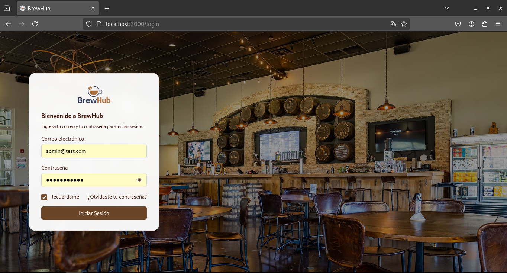
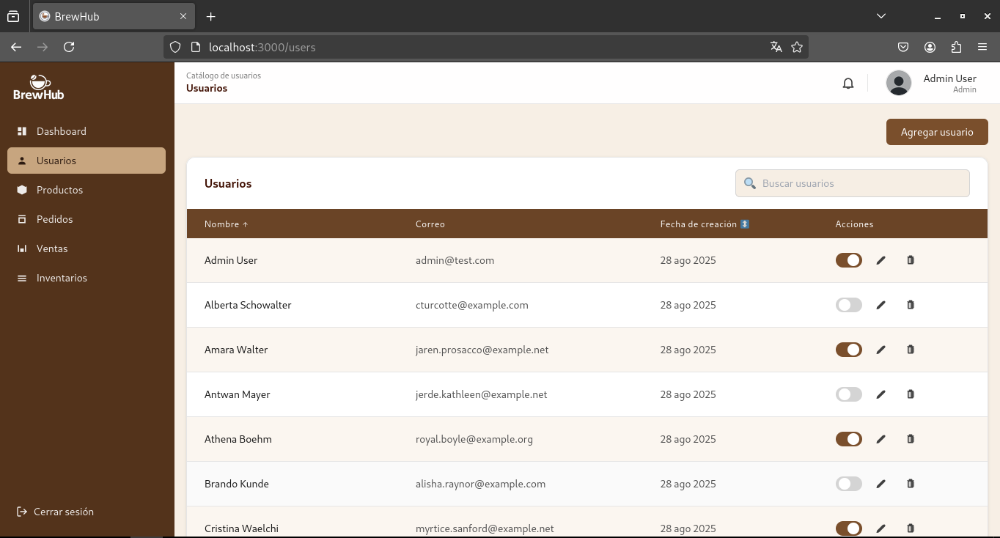

# BrewHub

Monorepo del ejercicio práctico: **API en Laravel (MySQL, Sanctum)** + **Frontend en React + TypeScript + Tailwind** con diseño **Atomic Design**.

- Login con validación real contra BD y emisión de **Bearer token** (Sanctum).
- Tabla de usuarios con ordenamiento por **nombre** y **Fecha de creación**.
- Rutas protegidas en el frontend con **contexto de autenticación**.

## Capturas

Login  


Listado de usuarios  


---

## Requisitos

### Backend

- **PHP** ≥ 8.1.x
- **Composer** ≥ 2.2.x
- **MySQL**
- **Laravel** 10

### Frontend

- **Node.js** ≥ 18
- **npm** ≥ 9

---

## Estructura del repositorio

```

BrewHub/
├─ assets/
│ ├─ login.png
│ └─ list-users.png
├─ backend/ # Laravel API (Sanctum)
│ └─ README.md # Guía detallada backend
├─ frontend/ # React + TS + Tailwind
│ └─ README.md # Guía detallada frontend
└─ README.md # (este archivo)

```

---

## Instrucciones rápidas

### 1) Backend (Laravel)

```bash
cd backend
composer install
cp .env.example .env
# Configura credenciales de MySQL en .env
php artisan key:generate
php artisan migrate:fresh --seed
php artisan serve
```

- API por defecto en: **[http://127.0.0.1:8000](http://127.0.0.1:8000)**
- Endpoints principales:

  - `POST /api/login`
  - `GET /api/me` (requiere Bearer)
  - `GET /api/users` (requiere Bearer)
  - `POST /api/logout` (requiere Bearer)

**Usuario de prueba (seed):**

- Email: `admin@test.com`
- Password: `password123`

> Autenticación: el backend emite un **token Sanctum** que el frontend guarda en **localStorage** y envía en `Authorization: Bearer <token>`.

---

### 2) Frontend (React + TypeScript + Tailwind)

```bash
cd frontend
npm install
npm start
```

- App por defecto en **[http://localhost:3000](http://localhost:3000)**
- Configurar base URL (si es necesario) en `src/services/api.ts`:

  ```ts
  const API_BASE_URL = "http://localhost:8000/api";
  ```

---

## Información sobre el proyecto práctico

- **Funcionalidad**

  - [x] Login funcional contra BD (Laravel + Sanctum).
  - [x] Redirección a `/users` en login exitoso.
  - [x] Tabla con usuarios, ordenable por **nombre** y **fecha**.
  - [x] Botón “Cerrar Sesión” que invalida cliente y redirige a `/login`.

- **Estructura de código**

  - [x] **Atomic Design** en el frontend (`atoms`, `molecules`, `organisms`, `templates`, `pages`).
  - [x] Buenas prácticas Laravel (rutas, controladores, requests, seeders, factories).

- **Estilo**

  - [x] Tailwind CSS para estilos.

- **Migraciones**

  - [x] Tabla `users` con `id`, `name`, `email (unique)`, `password`, `timestamps`.
  - [x] `Seeder` y `Factory` para poblar datos.

---

## Preguntas

### ¿Cómo organizaste los componentes según Atomic Design y por qué?

- **Átomos**: piezas mínimas reutilizables (Button, Input, Label, Spinner).
- **Moléculas**: combinación de átomos con una intención (InputField, UserRow, LoginForm).
- **Organismos**: bloques funcionales completos (Header, UserTable, LoginCard).
- **Templates**: layout de página (AuthLayout, DashboardLayout).
- **Pages**: pantallas con routing y lógica de página (Login, Users).

Esto favorece **modularidad**, **reutilización** y **escalabilidad**.

### ¿Qué problemas enfrentaste y cómo los solucionaste?

- **CORS / Autenticación**: ajuste de `config/cors.php` y headers del cliente; se usa **Bearer token** via Sanctum para simplificar el flujo.
- **Protección de rutas**: `ProtectedRoute` y `AuthContext` con chequeo de token y `authService.me()`.
- **Ordenamiento en tabla**: parámetros `sort_by` y `sort_direction` en la API; hooks en la tabla para alternar asc/desc.

### ¿Cómo aseguraríamos la seguridad del sistema de login?

- **Hash de contraseñas** (Laravel lo hace por defecto) y **validación de inputs** (`LoginRequest`).
- **Sanctum tokens** con posibilidad de **revocación** (logout) y expiración configurable.
- **HTTPS** en producción, `SameSite` y CORS restringidos.
- **Rate limiting** para endpoints de auth (`throttle`).
- Limpieza de credenciales en cliente y rutas protegidas en el router.

---

## Solución técnica (resumen)

- **Backend**:

  - Rutas en `routes/api.php`.
  - `AuthController` (login, me, logout) usando **Sanctum**.
  - `UserController@index` con ordenamiento.
  - `LoginRequest` con validación.
  - `Seeder` + `Factory` para poblar datos.

- **Frontend**:

  - **AuthContext** para manejo global de auth.
  - **Axios interceptor** que agrega `Authorization: Bearer <token>`.
  - **ProtectedRoute** para /users.
  - **UsersTable** con ordenamiento, errores y spinner.
  - Estructura basada en **Atomic Design**.

---

## Troubleshooting

- **401 / No autorizado**

  - Verifica login y token en `localStorage`.
  - Axios debe incluir `Authorization: Bearer <token>`.
  - Confirma URL de backend en `API_BASE_URL`.

- **CORS**
  Revisar `config/cors.php` y `SANCTUM_STATEFUL_DOMAINS(.env)`.
